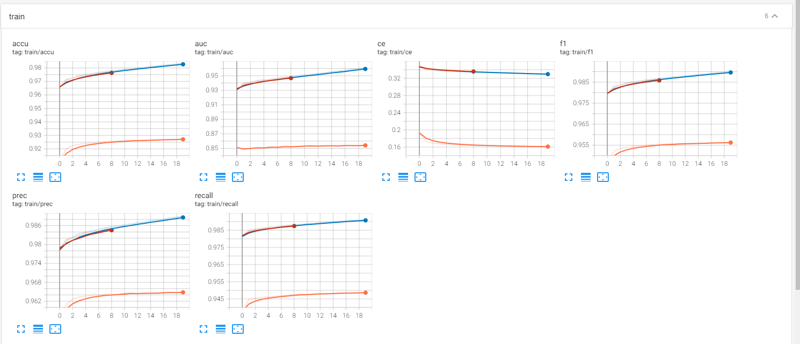

# 使用说明
## 介绍
目前该部分代码是用来训练VAD。是VAD仓库的重构版本。
目前支持的模型由DNN、RNN、LSTM模型。

## 数据集
该部分数据集来源于TIMIT。
标签来源于Data_driven所预测生成的标签。

## 噪声


## 特征
该部分代码使用的是13维的MFCC特征+1维的能量。总共14维。

## 数据预处理过程
该部分代码首先对音频数据进行预处理。对于每一个音频文件进行提取其特征并保存为.npy文件，同时存放在/data/feats/目录下。
数据预处理部分只需要进行一次，因此为了减少后面花费的时间，这个步骤只运行一次即可。

## 环境依赖
该仓库建议直接使用conda创建新环境
```shell
conda env create -f environment.yml
```
> 注意：由于本地的pytorch是通过conda -c pytorch安装，而清华源中是没有的。因此建议pytorch另外通过pip安装

下列库应该通过pip安装：pytorch torchvision torchaudio cudatoolkit=11.3

## 使用示例
1. 训练代码
```shell
conda activate voice
python train.py --mode_type=dnn_vad --train_list=F:\workspace\GHT\projects\vad\small_data\feat\train_feats.txt / 
  --train_label_list=F:\workspace\GHT\projects\vad\small_data\labels/small_train_lbl_dict.json /
  --val_list=F:\workspace\GHT\projects\vad\small_data\feat\val_feats.txt /
  --val_label_list=F:\workspace\GHT\projects\vad\small_data\labels/small_val_lbl_dict.json
```
以上示例说明使用dnn模型进行训练。
2.评估代码
```shell
python eval.py ...
```
3.查看训练过程中的评估指标
```shell
tensorboard --logdir=./checkpoints
```
然后访问http://localhost:6006/即可看到训练的各种指标参数


**待补充**

## 使用参数
| 参数名        | 说明                                           |
|------------|----------------------------------------------|
| model_type | 表示选择哪种模型开始训练。可以有的选择为dnn_vad、rnn_vad、lstm_vad |
| train_list | 训练数据集所在的地方                                   |
| train_label_list | 训练数据集标签所在的地方                                 |
| val_list      | 验证集所在的地方                                     |
| val_label_list | 验证集标签所在的地方                                   |


其他的一些参数options.py中代码说明，后续再做补充。